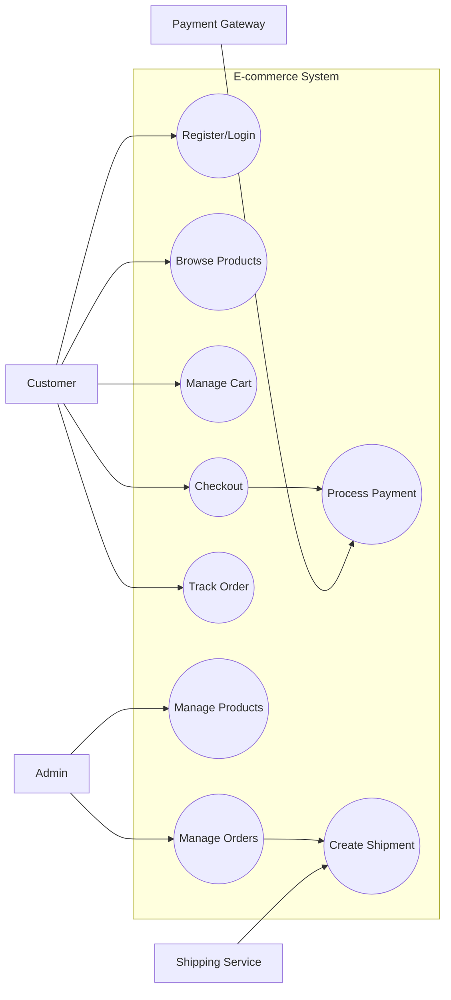
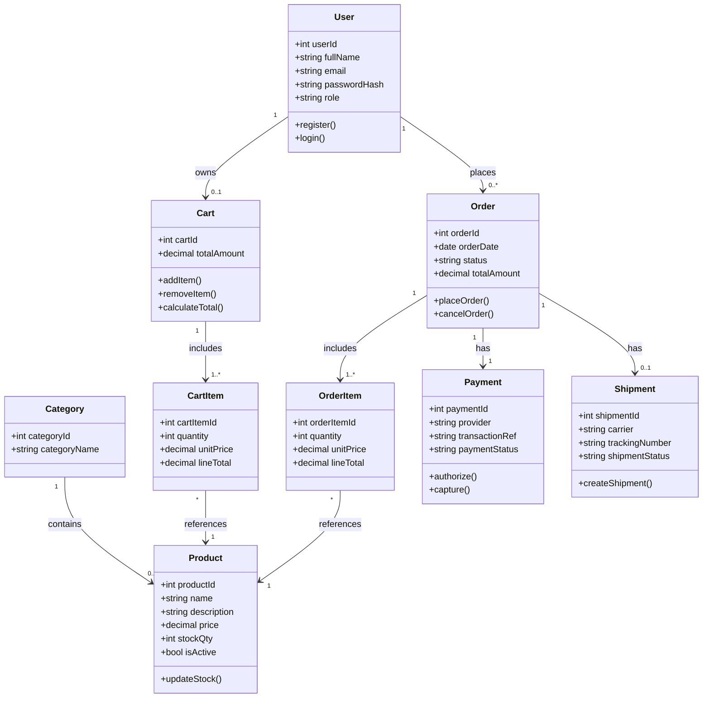
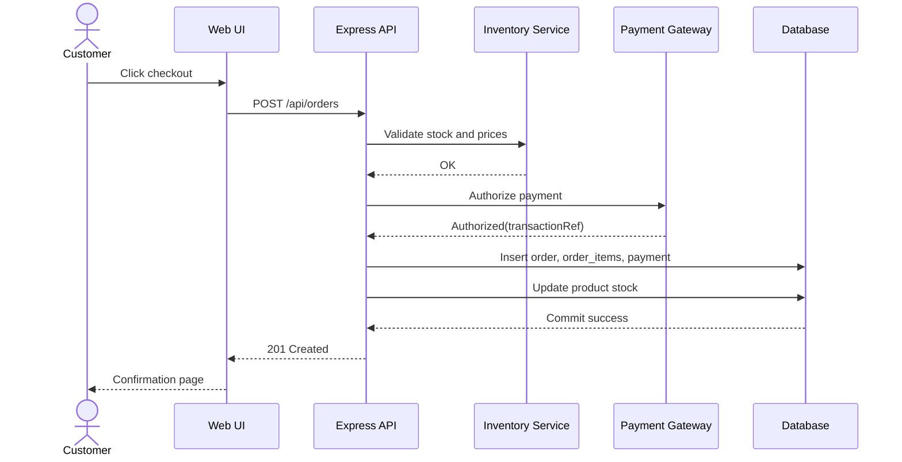
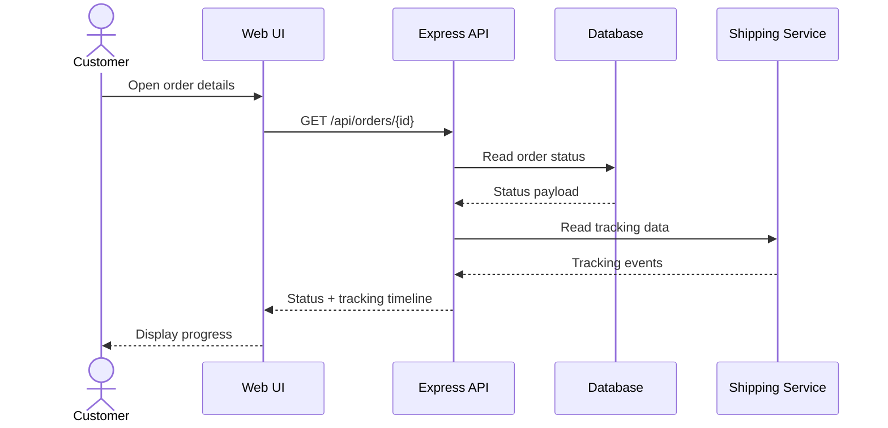
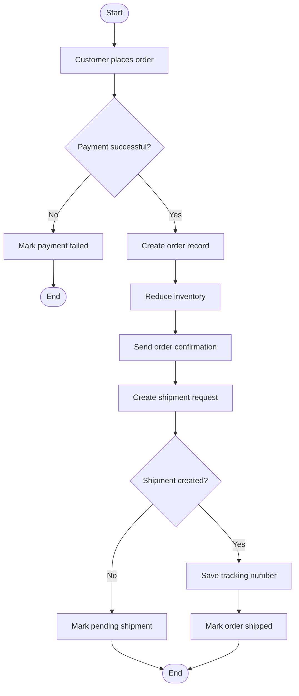
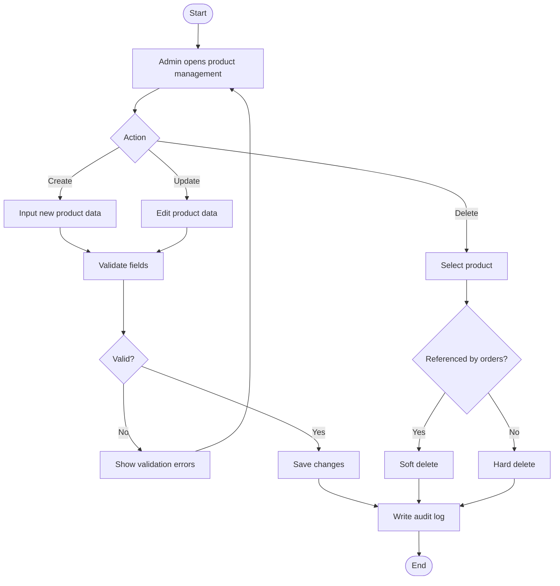
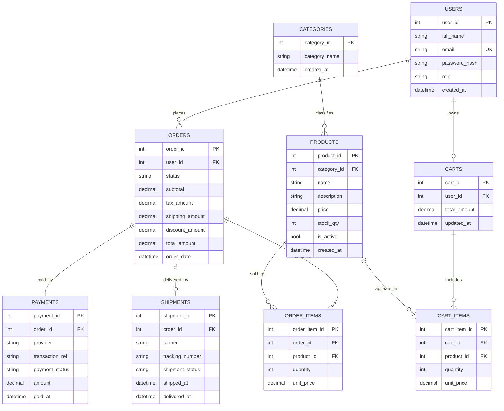

# System Analysis and Design Deliverables

<!-- markdownlint-disable MD022 MD032 MD060 -->

System: RSTstore Web Application (Vanilla JS + Node.js/Express + Relational Database)

## Table of Contents

1. [Project Overview](#1-project-overview)
2. [Architecture](#2-architecture)
3. [System Analysis](#3-system-analysis)
4. [System Design](#4-system-design)
5. [Database Design](#5-database-design)
6. [API Reference](#6-api-reference)
7. [Role and Permissions Matrix](#7-role-and-permissions-matrix)
8. [Assumptions and Constraints](#8-assumptions-and-constraints)

---

## 1. Project Overview

This project is a full-stack e-commerce web application designed for customers and administrators. The frontend is implemented using HTML5, CSS3, and Vanilla JavaScript. The backend is implemented with Node.js and Express, exposing REST APIs for catalog, cart, checkout, and order management. Data is persisted in a relational database.

### 1.1 Business Goals

- Provide a fast, responsive online shopping experience.
- Support secure authentication and role-based access.
- Ensure consistent order processing with transaction-safe stock updates.
- Offer maintainable architecture that can scale horizontally at the API layer.

### 1.2 Scope

In scope:
- Product catalog browsing and filtering.
- User registration, login, profile access.
- Cart management and checkout.
- Payment and shipment integration.
- Admin management of products, categories, and order statuses.

Out of scope:
- Multi-vendor marketplace features.
- Native mobile app clients.
- Advanced recommendation engine.

### 1.3 Stakeholders (Actors)

| Actor | Description |
|-------|-------------|
| Customer | Browses products, manages cart, places orders, and tracks shipments |
| Admin | Manages products, categories, inventory, discounts, and order statuses |
| Payment Gateway | External provider that authorizes and captures payments |
| Shipping Service | External provider that creates shipments and provides tracking events |
| System Operator | Monitors logs, incidents, service health, and operational reports |

### 1.4 Tech Stack Summary

| Layer | Technology | Purpose |
|-------|-----------|---------|
| Frontend | HTML5, CSS3, JavaScript (ES6+) | Product UI, cart UI, checkout UI |
| Backend Runtime | Node.js | Server-side execution |
| Backend Framework | Express.js | Routing, middleware, API handling |
| Authentication | JWT + bcrypt | Session tokenization and password hashing |
| Database | MySQL or PostgreSQL | Relational storage for core business data |
| API Style | REST + JSON | Client-server communication |
| Deployment | Reverse proxy + Node process manager | Production hosting and process resilience |

---

## 2. Architecture

### 2.1 System Architecture Diagram

```text
┌──────────────────────────────────────────────────────────────────────────────┐
│                                 CLIENT LAYER                                 │
│                                                                              │
│  ┌───────────────────────────────┐    ┌──────────────────────────────────┐   │
│  │Browser (Desktop/Tablet/Mobile)│    │ Static Assets (HTML/CSS/JS/Imgs) │   │
│  └───────────────────────┬───────┘    └────────────────┬─────────────────┘   │
└──────────────────────────┼─────────────────────────────┼─────────────────────┘
                           │ HTTP/HTTPS or WebSocket     │
                           └───────────────┬─────────────┘
                                           │
                      ┌────────────────────▼─────────────────────┐
                      │         NODE.JS + EXPRESS API            │
                      │                                          │
                      │  CORS -> Rate Limit -> JWT Auth -> RBAC  │
                      │                                          │
                      │  Route Groups:                           │
                      │  /api/auth/*                             │
                      │  /api/products/*                         │
                      │  /api/cart/*                             │
                      │  /api/orders/*                           │
                      │  /api/admin/*                            │
                      └────────────────────┬─────────────────────┘
                                           │
                           ┌───────────────▼────────────────┐
                           │      Service/Repository Layer  │
                           │  Validation, pricing, stock,   │
                           │  checkout orchestration        │
                           └───────────────┬────────────────┘
                                           │
                ┌──────────────────────────▼──────────────────────────┐
                │                RELATIONAL DATABASE                  │
                │ users, categories, products, carts, cart_items,     │
                │ orders, order_items, payments, shipments            │
                └─────────────────────────────────────────────────────┘
```

### 2.2 Data Flow

1. Browser requests pages and static assets.
2. Frontend JS calls REST endpoints using fetch.
3. Express middleware validates CORS, rate limits, and auth token.
4. Route handler executes business rules and database operations.
5. Checkout flow validates stock and payment, then commits order transaction.
6. API responds with standardized JSON payload.

### 2.3 Frontend Architecture

#### 2.3.1 Frontend Application Structure

```text
app/
├── index.html                      # Main application shell loaded by the browser
├── package.json                    # Frontend dependencies and scripts
├── app.json                        # Frontend app configuration
├── assets/
│   └── images/                     # Logos, banners, product placeholders, theme assets
├── pages/
│   ├── home.html                   # Customer landing page
│   ├── catalog.html                # Product listing and filters page
│   ├── product-details.html        # Product details and gallery page
│   ├── cart.html                   # Cart review page
│   ├── checkout.html               # Checkout page
│   ├── orders.html                 # Customer order history page
│   ├── admin-dashboard.html        # Admin dashboard page
│   ├── admin-products.html         # Product CRUD page
│   └── admin-orders.html           # Admin order management page
└── src/
        ├── html/
        │   ├── partials/
        │   │   ├── header.html          # Reusable site header
        │   │   ├── footer.html          # Reusable site footer
        │   │   ├── product-card.html    # Product card template fragment
        │   │   └── cart-drawer.html     # Cart drawer template fragment
        │   └── layouts/
        │       ├── customer-layout.html # Shared customer page layout
        │       └── admin-layout.html    # Shared admin page layout
        ├── api/
        │   ├── client.js               # Shared fetch client with auth header and error handling
        │   ├── auth.js                 # Authentication API calls (login, register, logout, profile)
        │   ├── products.js             # Catalog API calls (list, details, search, filter)
        │   ├── cart.js                 # Cart API calls (add, update, remove, summary)
        │   ├── orders.js               # Checkout and order history API calls
        │   ├── admin.js                # Admin API calls (products, categories, orders, inventory)
        │   ├── settings.js             # Profile and application settings API calls
        │   └── notifications.js        # Notification and alert API calls
        ├── components/
        │   ├── ProductCard.js          # Product tile used in catalog and search results
        │   ├── ProductGallery.js       # Product image gallery and preview area
        │   ├── CartDrawer.js           # Slide-out cart summary
        │   ├── QuantityStepper.js      # Quantity input control
        │   ├── CheckoutSummary.js      # Order totals, tax, shipping, and discount panel
        │   ├── OrderStatusBadge.js     # Order lifecycle status label
        │   ├── DashboardCard.js        # KPI/statistics card for customer/admin dashboards
        │   ├── DataTable.js            # Reusable table for admins and reports
        │   ├── FilterBar.js            # Search, category, and price filter controls
        │   ├── NotificationPanel.js    # Alerts, system messages, and order updates
        │   ├── ThemeToggle.js          # Light/dark/contrast mode switch
        │   ├── SettingsForm.js         # Account and preferences editor
        │   ├── Modal.js                # Generic modal wrapper
        │   └── common/                 # Shared UI primitives (buttons, inputs, badges, tabs)
        ├── context/
        │   ├── AuthContext.js          # Auth state, role, and session context
        │   ├── CartContext.js          # Cart state and persistence context
        │   ├── ThemeContext.js         # Theme, accent color, density, and layout mode
        │   └── UIContext.js            # Sidebar, modal, toast, and loader state
        ├── data/
        │   ├── categories.js           # Catalog category and subcategory hierarchy
        │   ├── navigation.js           # Menu definitions for customer/admin layouts
        │   ├── themes.js               # Theme presets and color tokens
        │   └── constants.js            # Shared labels, statuses, and filters
        ├── hooks/
        │   ├── useAuth.js              # Read auth/session state
        │   ├── useCart.js              # Read/update cart state
        │   ├── useTheme.js             # Read/update theme settings
        │   └── useResponsive.js        # Responsive breakpoint hook
        ├── navigation/
        │   ├── AppNavigator.js         # Root route switcher based on auth and role
        │   ├── CustomerNavigator.js    # Customer navigation flow
        │   ├── AdminNavigator.js       # Admin navigation flow
        │   └── ProtectedRoute.js       # Auth and role guard wrapper
        ├── screens/
        │   ├── auth/
        │   │   ├── LoginScreen.js      # Email/password sign-in page
        │   │   ├── RegisterScreen.js   # Account creation page
        │   │   └── ForgotPasswordScreen.js # Password recovery page
        │   ├── customer/
        │   │   ├── HomeScreen.js       # Landing page and featured products
        │   │   ├── CatalogScreen.js    # Browsing, search, and filtering
        │   │   ├── categories/         # College-specific view components
        │   │   │   ├── Dentistry/      # Clinical, Study Models, Materials, PPE
        │   │   │   ├── PhysicalTherapy/# Assessment, Rehab, Anatomy, Clinic
        │   │   │   ├── Nursing/        # Diagnostic, Uniforms, Accessories, Study
        │   │   │   ├── Engineering/    # Drafting, Electronics, Tools, Software
        │   │   │   ├── ComputersAI/    # Hardware, Networking, Peripherals, Storage
        │   │   │   ├── BusinessAdmin/  # Exec, Presentation, Tech, Desk
        │   │   │   ├── AppliedHealth/  # Lab, Microscopy, Diagnostic, Safety
        │   │   │   └── Pharmacy/       # Compounding, Dispensing, Reference, Apparel
        │   │   ├── ProductDetailsScreen.js # Product details and gallery
        │   │   ├── CartScreen.js       # Cart review and quantity changes
        │   │   ├── CheckoutScreen.js   # Shipping and payment checkout
        │   │   ├── OrdersScreen.js     # Order history and tracking
        │   │   └── ProfileScreen.js    # Customer profile and account overview
        │   ├── admin/
        │   │   ├── AdminDashboardScreen.js # Sales, orders, and stock dashboard
        │   │   ├── AdminProductsScreen.js   # Product CRUD management
        │   │   ├── AdminCategoriesScreen.js # Category management
        │   │   ├── AdminOrdersScreen.js     # Order status and fulfillment management
        │   │   ├── AdminInventoryScreen.js  # Stock monitoring and replenishment
        │   │   ├── AdminUsersScreen.js      # User and role management
        │   │   ├── AdminReportsScreen.js     # Sales, inventory, and activity reports
        │   │   └── AdminSettingsScreen.js    # System settings, themes, and preferences
        │   ├── shared/
        │   │   ├── SettingsScreen.js     # Shared app settings for profile and preferences
        │   │   ├── NotificationsScreen.js # Alerts and system messages
        │   │   ├── DashboardScreen.js    # Shared summary dashboard
        │   │   ├── AboutScreen.js        # Application/about information
        │   │   └── HelpScreen.js         # Help and support content
        │   └── errors/
        │       ├── NotFoundScreen.js     # 404 screen
        │       └── AccessDeniedScreen.js # Unauthorized access screen
        ├── services/
        │   ├── auth.service.js          # Session, login, logout, and token handling
        │   ├── cart.service.js          # Cart persistence and sync helpers
        │   ├── theme.service.js         # Theme persistence and initialization
        │   ├── notification.service.js  # Toasts, alerts, and badge counters
        │   └── analytics.service.js     # Event tracking and UI metrics
        └── styles/
                ├── base.css                # Reset, typography, and element defaults
                ├── variables.css           # Color palette, spacing, typography tokens
                ├── layout.css              # Grid, sidebar, header, and page layout rules
                ├── themes.css              # Theme variants and overrides
                ├── pages.css               # Page-level styles for home, catalog, checkout, admin
                ├── utilities.css           # Utility classes for spacing, display, alignment
                └── components.css          # Shared component styling
```

##### 2.3.1.1 Product Catalog Taxonomy (Colleges & Subcategories)

The application structure supports the following product hierarchy:
┌───────────────────────────────────────────────────────────────┐
| College (Primary Category) | Subcategories (Secondary Groups) |
|----------------------------|----------------------------------|
| **Dentistry** | Clinical Instruments, Study Models, Dental Materials, Apparel & PPE |
| **Physical Therapy** | Assessment Tools, Rehabilitation Gear, Anatomy Aids, Clinic Supplies |
| **Nursing** | Diagnostic Tools, Uniforms & Footwear, Clinical Accessories, Study Aids |
| **Engineering** | Drafting & Drawing, Electronics & Robotics, Tools & Hardware, Software & Tech |
| **Computers & AI** | Dev Hardware, Networking, Peripherals, Storage Solutions |
| **Business Administration** | Executive Organization, Presentation Tools, Tech Accessories, Desk Essentials |
| **Applied Health Sciences** | Lab Equipment, Microscopy, Diagnostic Kits, Safety Apparel |
| **Pharmacy** | Compounding Tools, Dispensing Supplies, Reference Materials, Lab Apparel |

#### 2.3.2 Frontend Responsibilities

- Render customer, admin, and shared screens from a single codebase.
- Keep HTML pages/partials modular so shared structures are reused consistently.
- Keep CSS organized into base, layout, theme, page, and component layers.
- Guard protected routes based on authentication and role.
- Keep dashboard cards, tables, forms, and filters reusable across screens.
- Persist theme, session, and cart state between visits.
- Provide consistent loading, empty, success, and error UI states.
- Keep API calls isolated in a single client layer so UI code stays simple.

#### 2.3.3 Role-Based UI Layout

- Customer layout: catalog header, product grid, cart drawer, checkout flow, and order tracking.
- Admin layout: left navigation sidebar, KPI dashboard, data tables, forms, and audit tools.
- Shared layout: top bar, search, profile menu, notification badge, theme toggle, and language switch.

#### 2.3.4 Customer Screens

- HomeScreen for featured products, promotions, and quick entry points.
- CatalogScreen for category browsing, search, filter, and sort operations.
- ProductDetailsScreen for gallery, description, price, stock, and recommended items.
- CartScreen for quantity editing, item removal, subtotal, and coupon summary.
- CheckoutScreen for shipping, billing, payment, and confirmation preview.
- OrdersScreen for order history, shipment tracking, and status timeline.
- ProfileScreen for account details, addresses, and personal preferences.

#### 2.3.5 Admin Screens

- AdminDashboardScreen for sales totals, orders awaiting action, and low-stock alerts.
- AdminProductsScreen for create/update/delete operations and stock control.
- AdminCategoriesScreen for catalog grouping and category lifecycle management.
- AdminOrdersScreen for status updates, payment review, and fulfillment monitoring.
- AdminInventoryScreen for stock scanning, replenishment flags, and product visibility.
- AdminUsersScreen for customer and staff account oversight where permitted.
- AdminReportsScreen for inventory reports, sales trends, and operational summaries.
- AdminSettingsScreen for system settings, theme presets, and application behavior.

#### 2.3.6 Settings, Themes, and Personalization

- ThemeContext stores the active theme, accent color, and layout density.
- Theme presets can include light, dark, warm, cool, and high-contrast variants.
- SettingsScreen allows the user to change language, notifications, and profile data.
- Theme selection should be saved locally and restored on startup.
- Admin settings can expose additional controls for maintenance mode, feature toggles, and display preferences.

#### 2.3.7 Dashboard and Widget System

- DashboardCard is used for sales, orders, stock alerts, and quick actions.
- DataTable supports sortable columns, filters, bulk actions, and pagination.
- NotificationPanel shows order updates, payment issues, and admin warnings.
- Modal is used for editing products, confirming deletes, and reviewing details.
- FilterBar is used across catalog, admin lists, and report views.

#### 2.3.8 State and Navigation

- AuthContext stores the current user, role, and login status.
- CartContext keeps item counts, totals, and local persistence for guests.
- AppNavigator decides whether to show auth screens, customer screens, or admin screens.
- ProtectedRoute blocks unauthorized access and redirects to the correct screen.
- useResponsive adapts layouts for mobile, tablet, and desktop breakpoints.

#### 2.3.9 Frontend Workflow (Customer)

1. Open the app and restore theme and session state.
2. Browse featured products or search the catalog.
3. Open product details and add items to the cart.
4. Review the cart and proceed to checkout.
5. Receive confirmation and track the order later.

#### 2.3.10 Frontend Workflow (Admin)

1. Sign in and land on the admin dashboard.
2. Review KPIs, alerts, inventory, and pending orders.
3. Manage products, categories, and order statuses.
4. Update settings, themes, and notification preferences.
5. Inspect reports, user lists, and audit-related screens when needed.

### 2.4 Backend Architecture

#### 2.4.1 Backend Directory Structure

```text
backend/
├── package.json                    # Node dependencies and scripts
├── .env                            # Database, auth, payment, and shipping settings
├── server.js                       # Application entry point
├── app.js                          # Express app bootstrap (middleware, routes, error handler)
├── config/
│   ├── database.js                 # Relational database connection setup
│   ├── auth.js                     # JWT, password hashing, token expiry settings
│   ├── cors.js                     # CORS configuration
│   ├── payment.js                  # Payment gateway configuration
│   └── shipping.js                 # Shipping provider configuration
├── src/
│   ├── api/
│   │   ├── auth.js                 # Authentication API calls from server-to-server helpers if needed
│   │   ├── admin.js                # Admin orchestration endpoints and helpers
│   │   ├── catalog.js              # Product and category listing logic
│   │   ├── cart.js                 # Cart operations and totals
│   │   ├── checkout.js             # Checkout orchestration and transaction flow
│   │   ├── orders.js               # Order history, order tracking, and status updates
│   │   ├── notifications.js        # Email/SMS/in-app notification triggers
│   │   └── integrations.js         # External API adapters and wrappers
│   ├── controllers/
│   │   ├── auth.controller.js      # Register, login, logout, refresh, profile
│   │   ├── customer.controller.js  # Catalog, cart, checkout, and order history
│   │   ├── admin.controller.js     # Product, category, inventory, and order administration
│   │   ├── dashboard.controller.js # Metrics and summary endpoints
│   │   ├── settings.controller.js  # Profile, preferences, and theme settings
│   │   └── notification.controller.js # Alerts, unread counts, and activity notices
│   ├── routes/
│   │   ├── auth.routes.js          # /api/auth/*
│   │   ├── customer.routes.js      # /api/products, /api/cart, /api/orders
│   │   ├── admin.routes.js         # /api/admin/*
│   │   ├── dashboard.routes.js     # /api/dashboard/*
│   │   ├── settings.routes.js      # /api/settings/*
│   │   └── notification.routes.js  # /api/notifications/*
│   ├── services/
│   │   ├── auth.service.js         # Registration, login, password verification, token issuance
│   │   ├── customer.service.js     # Customer-facing catalog and order services
│   │   ├── catalog.service.js      # Product browsing, search, filtering, sorting
│   │   ├── cart.service.js         # Cart calculations and quantity updates
│   │   ├── pricing.service.js      # Subtotal, tax, discount, shipping, total computation
│   │   ├── inventory.service.js    # Stock validation, reservation, and decrementing
│   │   ├── checkout.service.js     # Order transaction coordination
│   │   ├── order.service.js        # Order creation, status changes, and history retrieval
│   │   ├── admin.service.js        # Admin CRUD workflows and moderation logic
│   │   ├── dashboard.service.js    # KPI, sales, stock, and activity summaries
│   │   ├── settings.service.js     # User preferences, themes, and account settings
│   │   └── notification.service.js # In-app, email, or SMS notification dispatch
│   ├── repositories/
│   │   ├── user.repository.js      # User data access
│   │   ├── product.repository.js   # Product and category data access
│   │   ├── cart.repository.js      # Cart and cart item data access
│   │   ├── order.repository.js     # Order and order item data access
│   │   ├── payment.repository.js   # Payment transaction persistence
│   │   ├── shipment.repository.js  # Shipment and tracking persistence
│   │   └── audit.repository.js     # Audit log and change history access
│   ├── middleware/
│   │   ├── auth.middleware.js      # JWT authentication middleware
│   │   ├── rbac.middleware.js      # Role-based access control
│   │   ├── validation.middleware.js # Request validation and sanitization
│   │   ├── rateLimit.middleware.js  # Request throttling protection
│   │   ├── error.middleware.js     # Global error handler
│   │   └── logger.middleware.js    # Request/response logging
│   ├── models/
│   │   ├── User.js
│   │   ├── Product.js
│   │   ├── Category.js
│   │   ├── Cart.js
│   │   ├── CartItem.js
│   │   ├── Order.js
│   │   ├── OrderItem.js
│   │   ├── Payment.js
│   │   └── Shipment.js
│   ├── integrations/
│   │   ├── paymentGateway.js      # External payment service adapter
│   │   ├── shippingProvider.js    # External shipping service adapter
│   │   └── notificationProvider.js # Email/SMS provider adapter
│   ├── utils/
│   │   ├── response.js            # Standard API response helpers
│   │   ├── errors.js              # Custom error classes
│   │   ├── constants.js           # Status codes, roles, and enums
│   │   └── formatters.js          # Currency, date, and message formatting
│   └── jobs/
│       ├── orderCleanup.job.js    # Expired pending order cleanup
│       ├── stockSync.job.js       # Inventory reconciliation job
│       └── notification.job.js    # Background notification processing
└── tests/
        ├── unit/
        ├── integration/
        └── api/
```

#### 2.4.2 Middleware Pipeline

1. Request logging and correlation ID creation.
2. CORS validation and rate limiting.
3. Body parsing, sanitization, and schema validation.
4. JWT authentication where required.
5. RBAC authorization based on user role.
6. Controller execution.
7. Service and repository interaction.
8. Global error handling and normalized response.

#### 2.4.3 Backend Design Principles

- Use layered architecture with clear separation of concerns.
- Keep controllers thin and delegate logic to services.
- Enforce transaction boundaries in checkout service.
- Centralize validation and error mapping.
- Use parameterized queries/ORM safeguards.
- Isolate payment and shipping integrations behind adapters.
- Keep dashboard and settings endpoints lightweight and cache-friendly.
- Log admin actions for auditability and traceability.

---

## 3. System Analysis

### 3.1 Functional Requirements

- FR1: Users can register, log in, and log out securely.
- FR2: Users can browse/search/filter products by keyword, category, and price.
- FR3: Users can open product details with images, pricing, and stock information.
- FR4: Users can add/update/remove items in the cart.
- FR5: Users can submit checkout with shipping and payment details.
- FR6: System calculates subtotal, discount, tax, shipping, and total.
- FR7: System creates order records and stores payment references.
- FR8: Users can view order history and status timeline.
- FR9: Admin can manage product and category CRUD operations.
- FR10: Admin can update order statuses.
- FR11: System sends order and shipment notifications.

### 3.2 Non-Functional Requirements

- NFR1 Performance: Catalog API average response <= 2 seconds under normal load.
- NFR2 Availability: Target uptime >= 99.5%.
- NFR3 Security: Password hashing, JWT auth, HTTPS, and RBAC.
- NFR4 Scalability: API tier supports horizontal scale-out.
- NFR5 Reliability: Checkout and stock updates are transaction-safe.
- NFR6 Usability: Responsive UI across major screen sizes.
- NFR7 Maintainability: Layered architecture and modular route organization.

### 3.3 Use Case Diagram



### 3.4 Detailed Use Case Descriptions

#### UC-01 Register/Login
- Primary Actor: Customer
- Preconditions: Internet access is available.
- Main Flow:
1. User opens login/register page.
2. User submits credentials.
3. System validates input.
4. System authenticates or creates account.
5. System returns token/session.
- Alternate Flows:
1. Invalid credentials -> authentication failed message.
2. Duplicate email -> registration conflict message.
- Postconditions: Authenticated session established.

#### UC-02 Browse Products
- Primary Actor: Customer
- Preconditions: Product catalog contains active items.
- Main Flow:
1. User opens catalog.
2. System returns paginated products.
3. User applies search/filter.
4. System returns filtered results.
- Alternate Flows:
1. Empty result set -> show no-data state.
- Postconditions: User can open product details.

#### UC-03 Manage Cart
- Primary Actor: Customer
- Preconditions: At least one active product exists.
- Main Flow:
1. User selects item and quantity.
2. System adds item to cart.
3. User updates or removes lines.
4. System recalculates totals.
- Alternate Flows:
1. Quantity exceeds stock -> validation error.
- Postconditions: Cart reflects latest selections.

#### UC-04 Checkout
- Primary Actor: Customer
- Supporting Actor: Payment Gateway
- Preconditions: User is authenticated and cart is not empty.
- Main Flow:
1. User submits shipping and payment details.
2. System validates cart, stock, and pricing.
3. System requests payment authorization.
4. Gateway returns success.
5. System creates order and decrements stock.
6. System returns order confirmation.
- Alternate Flows:
1. Payment failed -> order not finalized.
2. Stock changed -> user must revise cart.
- Postconditions: Order saved with payment reference.

#### UC-05 Track Order
- Primary Actor: Customer
- Supporting Actor: Shipping Service
- Preconditions: Customer has at least one order.
- Main Flow:
1. User opens order details.
2. System returns current order status.
3. If shipped, system fetches tracking info.
- Postconditions: User sees latest order progress.

#### UC-06 Manage Products
- Primary Actor: Admin
- Preconditions: Admin role is authorized.
- Main Flow:
1. Admin opens product module.
2. Admin creates/updates/deletes product.
3. System validates and persists changes.
- Postconditions: Catalog is updated.

---

## 4. System Design

### 4.1 High-Level Design Components

- Presentation Layer: Browser pages, components, and DOM state management.
- API Layer: Express routes/controllers for auth, products, cart, and orders.
- Business Layer: Pricing, stock validation, order orchestration.
- Data Access Layer: Repository/ORM or query modules for SQL persistence.
- Integration Layer: Payment provider and shipping provider clients.

### 4.2 Class Diagram



### 4.3 Sequence Diagrams

#### 4.3.1 Checkout Sequence



#### 4.3.2 Order Tracking Sequence



### 4.4 Activity Diagrams

#### 4.4.1 Order Fulfillment



#### 4.4.2 Product Management Flow



---

## 5. Database Design

### 5.1 Entity Relationship Diagram (ERD)



### 5.2 Database Schema (Tables, Attributes, Relationships)

| Table | PK | FK | Core Attributes | Relationship Summary |
|-------|----|----|-----------------|----------------------|
| USERS | user_id | - | full_name, email, password_hash, role, created_at | One user can have many orders and one active cart |
| CATEGORIES | category_id | - | category_name, created_at | One category has many products |
| PRODUCTS | product_id | category_id -> CATEGORIES.category_id | name, description, price, stock_qty, is_active, created_at | One product appears in many cart and order items |
| CARTS | cart_id | user_id -> USERS.user_id | total_amount, updated_at | One cart includes many cart items |
| CART_ITEMS | cart_item_id | cart_id -> CARTS.cart_id; product_id -> PRODUCTS.product_id | quantity, unit_price | Belongs to one cart and references one product |
| ORDERS | order_id | user_id -> USERS.user_id | status, subtotal, tax_amount, shipping_amount, discount_amount, total_amount, order_date | One order has many order items, one payment, optional shipment |
| ORDER_ITEMS | order_item_id | order_id -> ORDERS.order_id; product_id -> PRODUCTS.product_id | quantity, unit_price | Belongs to one order and references one product |
| PAYMENTS | payment_id | order_id -> ORDERS.order_id | provider, transaction_ref, payment_status, amount, paid_at | One-to-one logical relationship with orders |
| SHIPMENTS | shipment_id | order_id -> ORDERS.order_id | carrier, tracking_number, shipment_status, shipped_at, delivered_at | Optional one-to-one relationship with orders |

### 5.3 Data Dictionary

| Table | Field | Type | Constraints | Description |
|-------|-------|------|-------------|-------------|
| USERS | user_id | INT | PK, auto-increment | Unique user identifier |
| USERS | email | VARCHAR(255) | UNIQUE, NOT NULL | User login email |
| USERS | role | ENUM('customer','admin') | NOT NULL | Authorization role |
| PRODUCTS | product_id | INT | PK, auto-increment | Unique product identifier |
| PRODUCTS | category_id | INT | FK, NOT NULL | Product category reference |
| PRODUCTS | price | DECIMAL(10,2) | NOT NULL, CHECK (price >= 0) | Product selling price |
| PRODUCTS | stock_qty | INT | NOT NULL, CHECK (stock_qty >= 0) | Available stock quantity |
| CART_ITEMS | quantity | INT | NOT NULL, CHECK (quantity > 0) | Quantity selected by customer |
| ORDERS | status | ENUM('Pending','Paid','Shipped','Delivered','Cancelled') | NOT NULL | Current order lifecycle state |
| ORDERS | total_amount | DECIMAL(10,2) | NOT NULL, CHECK (total_amount >= 0) | Final payable amount |
| PAYMENTS | transaction_ref | VARCHAR(100) | UNIQUE | Gateway transaction identifier |
| PAYMENTS | payment_status | ENUM('Authorized','Captured','Failed','Refunded') | NOT NULL | Payment lifecycle state |
| SHIPMENTS | tracking_number | VARCHAR(100) | UNIQUE | Carrier tracking code |
| SHIPMENTS | shipment_status | ENUM('Pending','Shipped','InTransit','Delivered','Returned') | NOT NULL | Shipment lifecycle state |

---

## 6. API Reference

### 6.1 Authentication

| Method | Endpoint | Access | Description |
|--------|--------|--------|-------------|
| POST | /api/auth/register | Public | Register new customer |
| POST | /api/auth/login | Public | Login and return JWT |
| POST | /api/auth/logout | Authenticated | End session |
| GET | /api/auth/me | Authenticated | Get current user profile |

### 6.2 Product Catalog

| Method | Endpoint | Access | Description |
|--------|----------|--------|-------------|
| GET | /api/products | Public | List products with pagination/filtering |
| GET | /api/products/{id} | Public | Get product details |
| GET | /api/categories | Public | List product categories |

### 6.3 Cart

| Method | Endpoint | Access | Description |
|--------|----------|--------|-------------|
| GET | /api/cart | Authenticated | Get current cart |
| POST | /api/cart/items | Authenticated | Add item to cart |
| PATCH | /api/cart/items/{itemId} | Authenticated | Update item quantity |
| DELETE | /api/cart/items/{itemId} | Authenticated | Remove item from cart |

### 6.4 Orders and Checkout

| Method | Endpoint | Access | Description |
|--------|----------|--------|-------------|      
| POST | /api/orders | Authenticated | Create order from cart |
| GET | /api/orders | Authenticated | List user orders |
| GET | /api/orders/{id} | Authenticated | Get order details and status |

### 6.5 Admin

| Method | Endpoint | Access | Description |
|--------|----------|--------|-------------|
| POST | /api/admin/products | Admin | Create product |
| PATCH | /api/admin/products/{id} | Admin | Update product |
| DELETE | /api/admin/products/{id} | Admin | Delete product |
| POST | /api/admin/categories | Admin | Create category |
| PATCH | /api/admin/orders/{id}/status | Admin | Update order status |

### 6.6 Standard Response Format

```json
{
  "success": true,
  "message": "Order created successfully",
  "data": {
    "orderId": 123,
    "status": "Paid"
  }
}
```

---

## 7. Role and Permissions Matrix

| Feature | Customer | Admin | System Operator |
|---------|----------|-------|-----------------|
| Register/Login| Yes | Yes | Yes |
| Browse catalog | Yes | Yes | Yes |
| Manage own cart | Yes | No | No |
| Place orders | Yes | No | No |
| View own order history | Yes | No | No |
| Manage products/categories | No | Yes | No |
| Update order statuses | No | Yes | No |
| View audit/ops logs | No | Optional | Yes |
| Manage system settings | No | Limited | Yes |

Notes:
- Admin has business management permissions.
- System Operator is operational and monitoring oriented.
- Customer permissions are restricted to own data scope.

---

## 8. Assumptions and Constraints

### 8.1 Assumptions

- SQL database is MySQL or PostgreSQL.
- Single-store e-commerce model.
- One payment record per order in baseline model.
- One shipment record per order in baseline model.

### 8.2 Constraints

- No marketplace multi-vendor logic in current scope.
- Payment and shipping rely on third-party API availability.
- Some notifications may be asynchronous based on provider callbacks.
